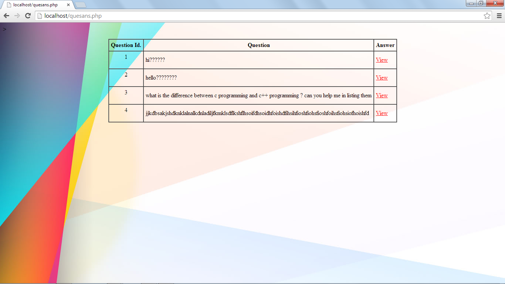
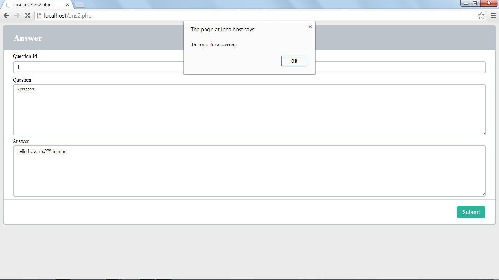

# Student-Hub
Tool for student welfare and students progress in carrers

## Scope

 	This project aims at creating web site for students for their better future. The basic idea is that the student of a particular college can share new ideas with their friends and professors.  It consists of student’s details, previous year university question papers, student polling, student and faculty interactions i.e. group discussions, faculty feedbacks, creating communities, questioning.  
  
 ### Problem definition:
```
AS per current education system student are not able to learn more concepts of programming .This would create communication gap between Staff and Student due to some issue i.e is personal or student may not get sufficient support to clear the doubts. This problem will effect students carrier as well as corporate world too .As student cant get required knowledge and execute the innovative  ideas . 
```

### Pre installed:
 XAMPP Server
 ## Step 1: Download and Install XAMPP
 To download and install XAMPP, [go to apachefriends downloads page](https://www.apachefriends.org/download.html), the official link to download XAMPP from. You will see XAMPP ready to download for cross-platform like Windows, Linux, Mac OS X. Since we are discussing How to install XAMPP on Windows 10, therefore, we will choose the Windows option as shown below.
 
 ## Step 2: Run the Installer to Install XAMPP
 1. XAMPP Setup Wizard
During the installation process, you may come across warning pop-ups. But you would probably click ‘Yes’ to start the installation process. Soon after you click on the downloaded file, the XAMPP setup wizard will open. Now click on the ‘Next’ Button to proceed.

2. Select Components
Next, you need to check the components which you want to install and can uncheck or leave as it is which you don’t want to install. You can see there are a few options which are light grey in color. These are the options which are necessary to run the software and will automatically be installed. Now click on the ‘Next’ button to continue.
3. Select Installation Folder
Now you need to choose the folder where you want to install the XAMPP. You can choose the default location or you can choose any location of your choice and choose the ‘Next’ button to move ahead.
4. Bitnami for XAMPP
Now will see a window showing you information about Bitnami. Simply click on the ‘Next’ button to move further. However, if you wish to learn more about the Bitnami, then you may check the box saying ‘Learn more about Bitnami for XAMPP.’
Basically Bitnami is for installing open source applications i.e. WordPress, Joomla etc on your newly installed XAMPP.
5. Ready to Install
Now you’ll see another window with a message “Setup is now ready to begin installing XAMPP on your computer” like shown below. You just have to hit the ‘Next’ button to proceed.
6. Welcome to XAMPP Wizard
Now just be patient and wait for the installation to complete.

7. Installation Complete
Once the installation is completed, you will be asked whether you would like to start the control panel now or not, displaying the message “Do you want to start the control panel now?” Check the box and click on the ‘Finish’ button and see if the XAMPP is working fine.
## Step 3: XAMPP is now Installed, run it
If the entire process of XAMPP installation went correctly, then the control panel would open smoothly. Now click on the ‘Start’ button corresponding to Apache and MySQL.


### Modules:
1. Login:-
It is the login session for the administrator student
and exit.

2. Student details:-
It is used to view student details from database.
3. Question Bank:-
It is used to store all the previous year question
papers in it.
4. Questioning:-
Here students can ask question related to syllabus to the
faculty. Here the student name will not be displayed
one id number will be given to each question. The
questions are sent to the specified subject faculty only no
other faculty can answer it.
# List of Questions asked by the students:

# Answering the questions page

5. Faculty feedback:-
Here students give feedback of a particular faculty for eg.
Is he/she regular to class, he/she teaches good or not
etc.
6. Additional features like calendar, events, IT fests, etc….

## Author
* **Rahul Kulkarni** - *Complete Project* - [Rahul Kulkarni](https://github.com/rahulkulkarni40)


